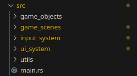

# Pong 2
<!-- #### Video Demo: <URL HERE> -->
A pong clone, but with a twist: now, you control the ball! Made using Rust and a Raylib binding.

## Gameplay

<p>Unlike the original pong, the player controls the ball instead of the paddle. The win and loss conditions are also inverted, this time you cannot touch the left and right
screen borders. If no input is received, the ball follows a straight line, changing its direction each time it hits a paddle. But, if input is received from WASD, arrow keys or a Gamepad, the player forces the ball out of its original trajectory, like trying to push a magnet away from its attraction.</p>
</br>

<p>There are two modes, singleplayer and local multiplayer. Both have the same objective: keep the ball alive while aiming for a 100 or higher score. The difference is that the singleplayer version has an AI for the paddles, while they are player controlled in the multiplayer. The ball has three lives and becomes harder to control the higher your score.</p>


## Description

<p>My objective with this project was to develop a simple game using a low level manner. In order to do that, I avoided full featured game engines and frameworks, deciding to use Rust with the (a Raylib biding)[https://docs.rs/raylib/latest/raylib/]. The project hiearchy can be summarized as following:</p>
<p align="left">
	
</p>


- <b>main.rs — </b> responsible for opening the game window and passing its handler to the active game scene. During each game frame the current scene its updated and then drawn;

- <b>game_objects — </b> elements that live in the game space: the ball and the paddle, each responsible for their own individual logic. The ball.rs has a function that updates the ball velocity based on current frame player input, for example. Because of the borrow checker, code related to interactions between the elements is handled by the active game scene (like when the ball hits the paddle);


- <b>game_scenes — </b> groups of both game objects and ui elements. They are responsible for handling all the frame updating and drawning of all the elements to the screen. There are only two, the Main Menu and the Game Loop;

   - <b>Main Menu — </b> a scene that contains all UI screens needed to start the game;

   - <b>Game Loop — </b> the main scene, where the gameplay occurs. Applies game logic for interactions between the elements and ensures that each of them is updated with the current player input;

- <b>ui_system — </b> handles the implementation code for the UI elements and screens;

- <b>input_system — </b> provides a single trait ("interface") with the current input data, abstracting details about the device used. Also responsible for cleaning the input, applying [SOCD](https://www.hitboxarcade.com/blogs/support/what-is-socd) in keyboards for example;

- <b>utils — </b> holds utility code, like functions that save and load the highscore from disk.

## How to build
Having [cargo](https://www.rust-lang.org/learn/get-started) installed, run ```cargo build --release```.